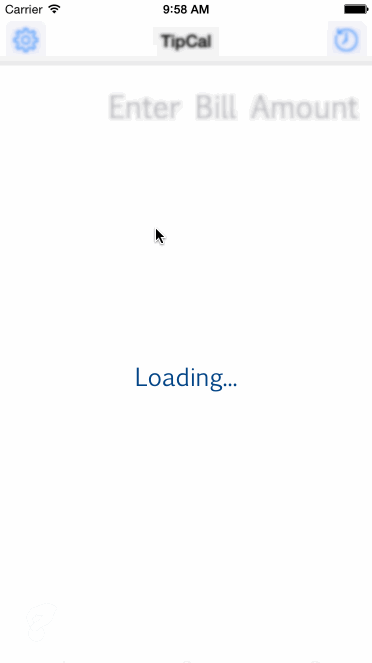

# Tip Calculator

A Tip Calculator application for iOS (in Swift) submitted as the [pre-work](http://bit.ly/iOS_prework) requirement for Codepath iOS bootcamp (September '15).

Time spent: 15 hours
 * Functionality: ~8 hours
 * UI/UX: ~3 hours
 * Testing/Bug Fixes: ~4 hours

#### Completed:

* [x] Required: User can enter a bill amount, choose a tip percentage, and see the tip and total values.
 * Use swipe gestures to adjust the tip % (left swipe to decrese % and right swipe to increase %)
* [x] Required: Settings page to change the default tip percentage.
* [x] Optional: UI animations
* [x] Optional: Remembering the bill amount across app restarts (if <10mins)
* [x] Optional: Using locale-specific currency and currency thousands separators.
* [x] Optional: Making sure the keyboard is always visible and the bill amount is always the first responder. This way the user doesn't have to tap anywhere to use this app. Just launch the app and start typing.
* [x] Additional: Ability to save a bill amount so that it can referred later. To save a bill amount
  (Bills are saved with the locale reference and are displayed in the locale saved they were saved in)
  1. Long press on the the bill total
  2. Enter a reference such as restaurant name
  3. Hit 'Ok'
* [x] Additional: View saved tip details in a table. To view tip details click any table cell.
* [x] Additional: A user setting for average bill amount per user
   (this is used in pre-calculating # of shares based on total bill amount)
* [x] Additional: User can view split amount for the total bill and also adjust # of split counts

#### Walkthrough:

GIF created with [LiceCap](http://www.cockos.com/licecap/).

#### Demo:

[Demo](https://www.youtube.com/watch?v=jn_i-FuJoQQ)

#### Development/Testing environment

* Operating System: Yosemite v10.10.4
* Xcode v6.4
* iOS v8.4
* Devices
 * iPhone 6 Simulator

#### Limiations

* The app currently works only in iPhone 6 - Potrait Mode

#### Further improvements to do:

* Make the app compatible with other devices
* Support Landscape mode
